# Portfolio CMS

---

## Introduction
Welcome to my project, a Portfolio CMS designed to help users manage their portfolio data effectively. Whether you're a freelancer, developer, designer, or any professional needing a digital showcase, this platform streamlines the process of organizing and presenting your skills and work.

---

## Features and Database Schema
The Portfolio CMS offers a range of features to facilitate portfolio management. Users can create an account, log in securely, and access their personalized dashboard. From there, they can add, edit, and delete projects, update their personal details, and manage their skills.

### Key Features:
- **User Authentication:** Secure user authentication system with password hashing and session management.
- **Factories and Seeders:** Creation of dummy data using the factories and seeders.
- **Dashboard:** Personalized dashboard the user, displaying an overview of their portfolio data.
- **Project Management:** Add, edit, and delete projects with details such as title, description, date, and images.
- **Skill Management:** Maintain a list of skills with proficiency levels, easily updateable through the dashboard.
- **Personal Details:** Keep personal information up-to-date, including name, email, phone, location, and social media links.

### Database Schema:
The database schema includes tables for users, projects, skills, and personal details, ensuring efficient storage and retrieval of portfolio data.

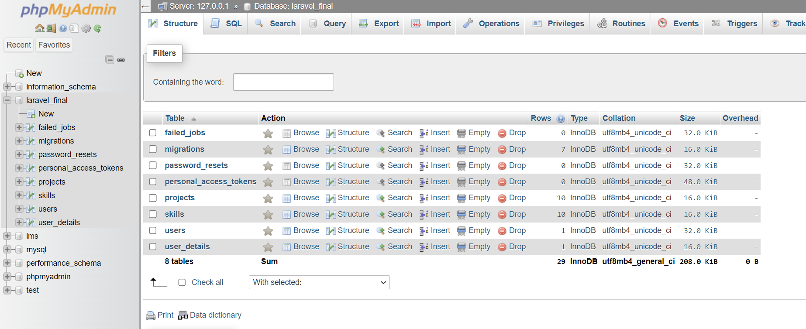
*DB Schema*

There is a join between the user and the user_details tables that is done using the user_id in the users_details migration that lets us access the personal details in the dashboard of the page. The code below depicts the process.

```php
        Schema::create('user_details', function (Blueprint $table) {
            $table->id();
            // Joining the user and user_details tables using user_id
            $table
                ->unsignedBigInteger('user_id')
                ->foreign('user_id')
                ->references('id')
                ->on('users')
                ->onDelete('cascade');
            $table->string('phone_number')->nullable();
            $table->string('image')->nullable();
            $table->string('address')->nullable();
            $table->text('description')->nullable();
            $table->text('whatsapp_no')->nullable();
            $table->text('fb_url')->nullable();
            $table->text('insta_url')->nullable();
            $table->text('linkedin_url')->nullable();
            $table->timestamps();
        });
```
---

## App Flow Screenshots
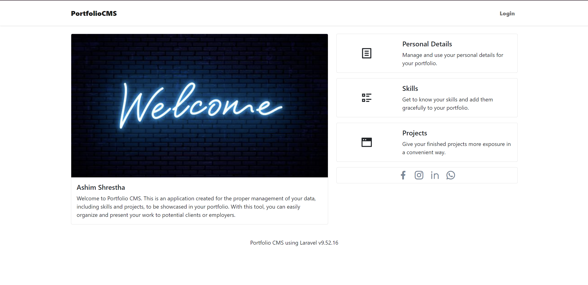
*Welcome Page*

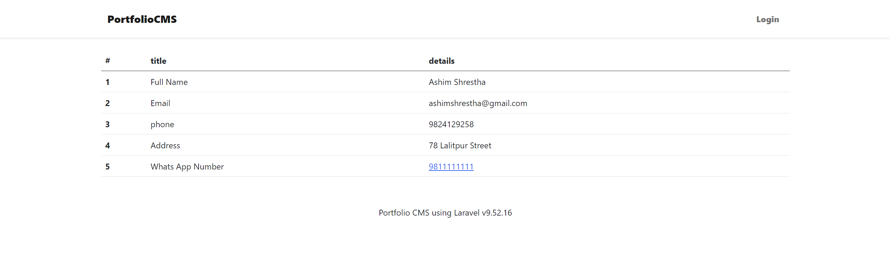
*User Details without login*

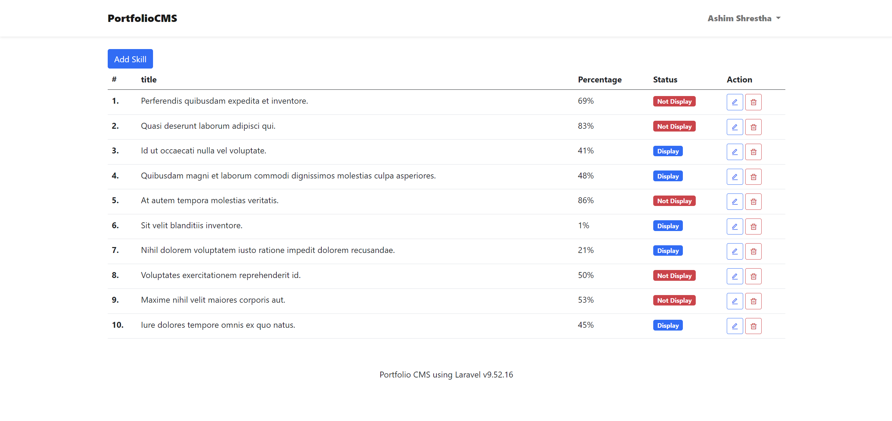
*Skills Page*

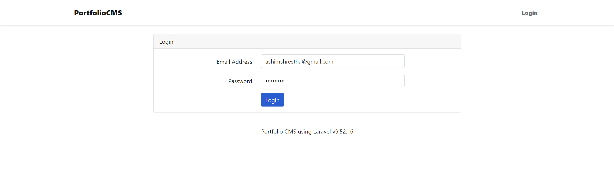
*Login Page*

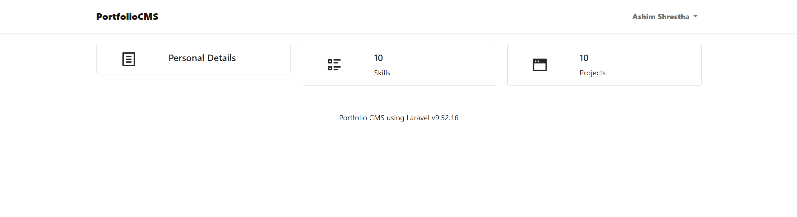
*Admin Dashboard*

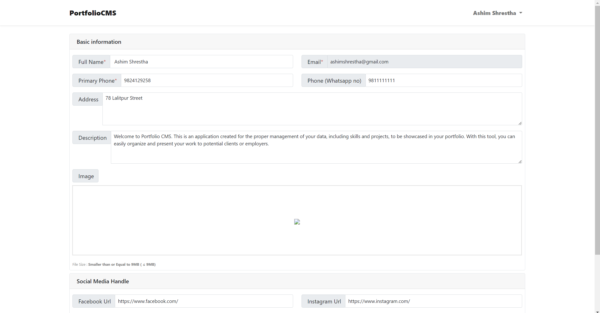
*User Details Update*

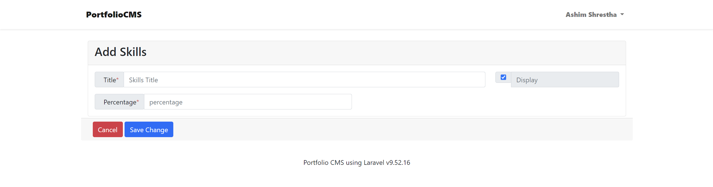
*Add Skills Page*

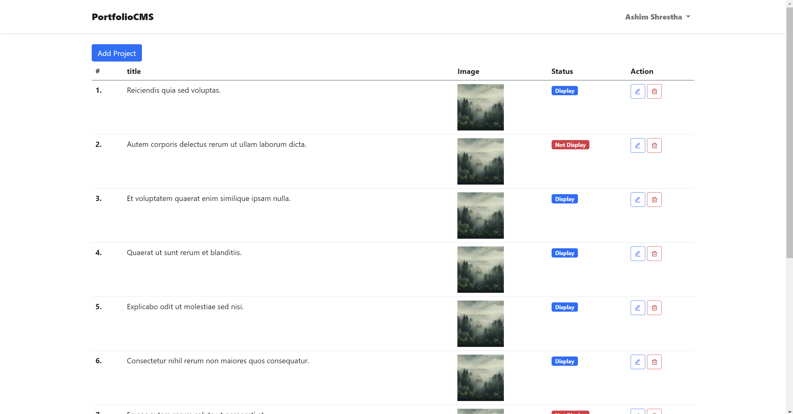
*Projects Page*

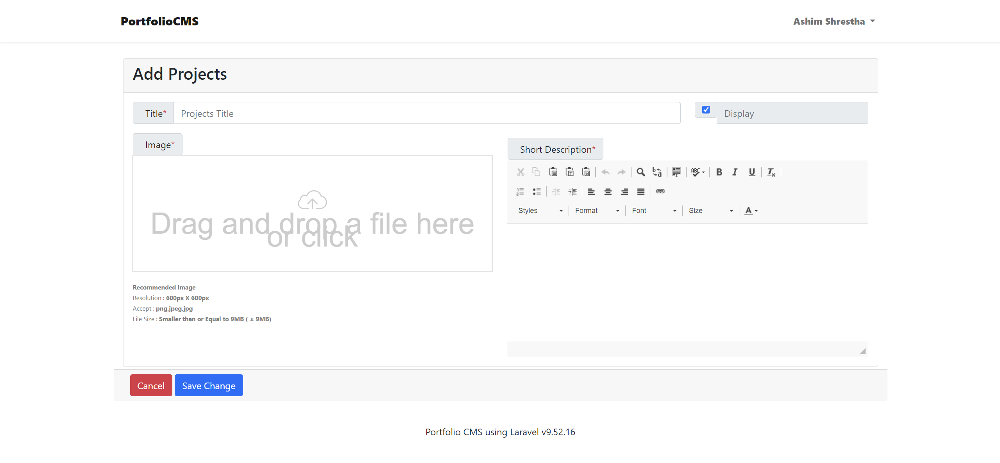
*Add Projects Page*

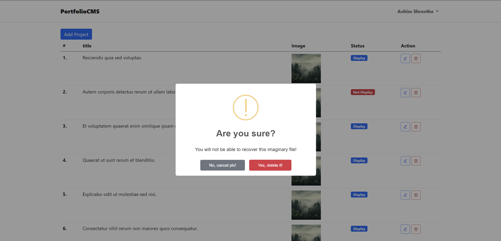
*Delete Example*

---

## Future Addition
To make the image adding feature dynamic. I was planning to use dynamic image upload feature but ran into some error compromising the app.

---

## Thoughts on Laravel and Supplementary Learnings
Laravel has been instrumental in the development of this project, offering a robust framework with built-in features such as routing, authentication, and database management. Moving forward, I would like to delve deeper into Laravel's testing capabilities to ensure the reliability and stability of the application. Additionally, exploring advanced topics such as API development and performance optimization would further enhance my understanding of Laravel and elevate my skills as a developer.
